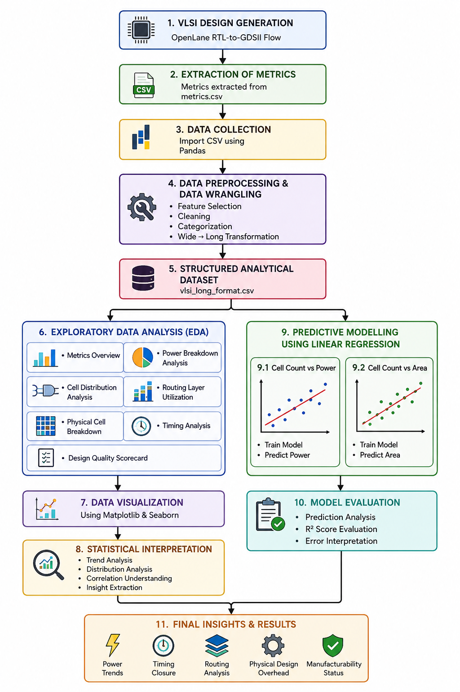
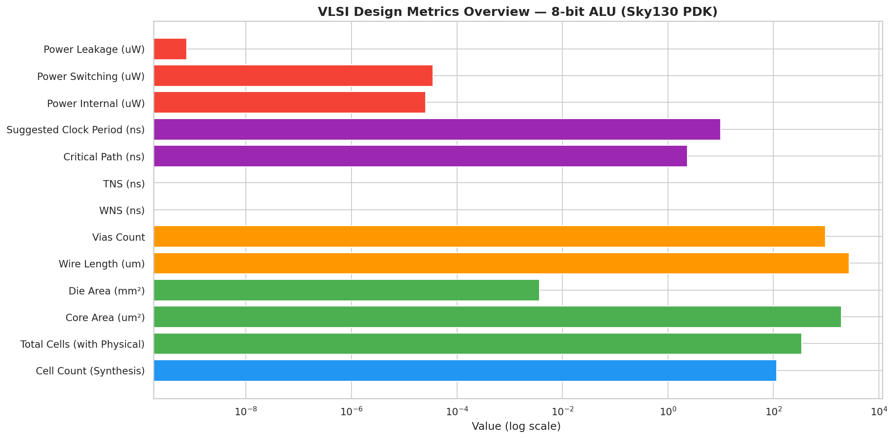
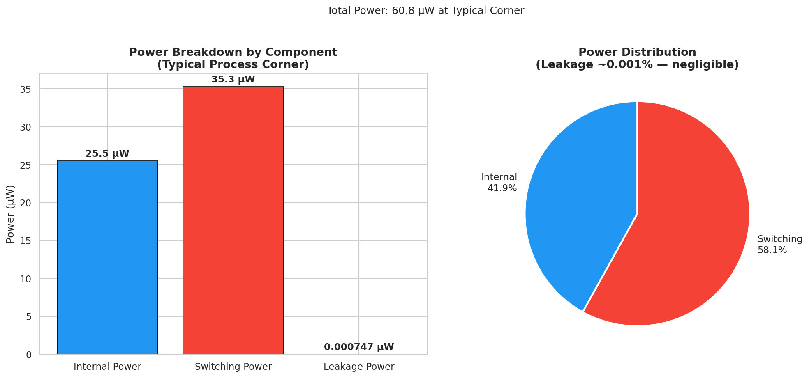
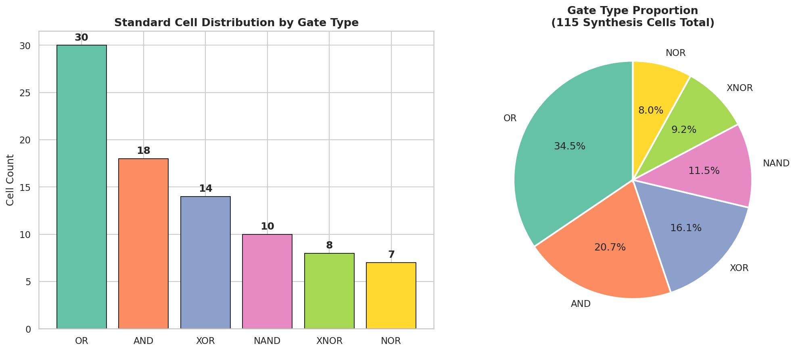
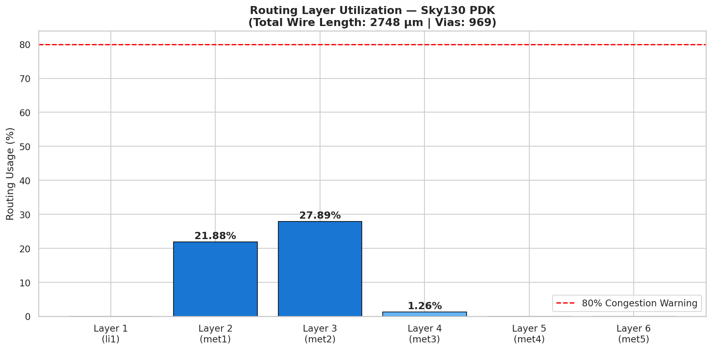
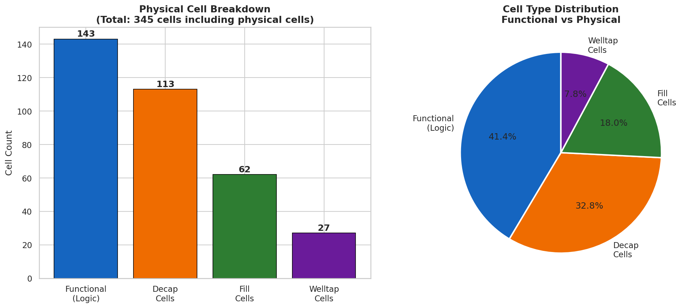
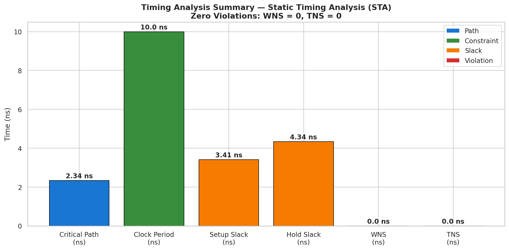
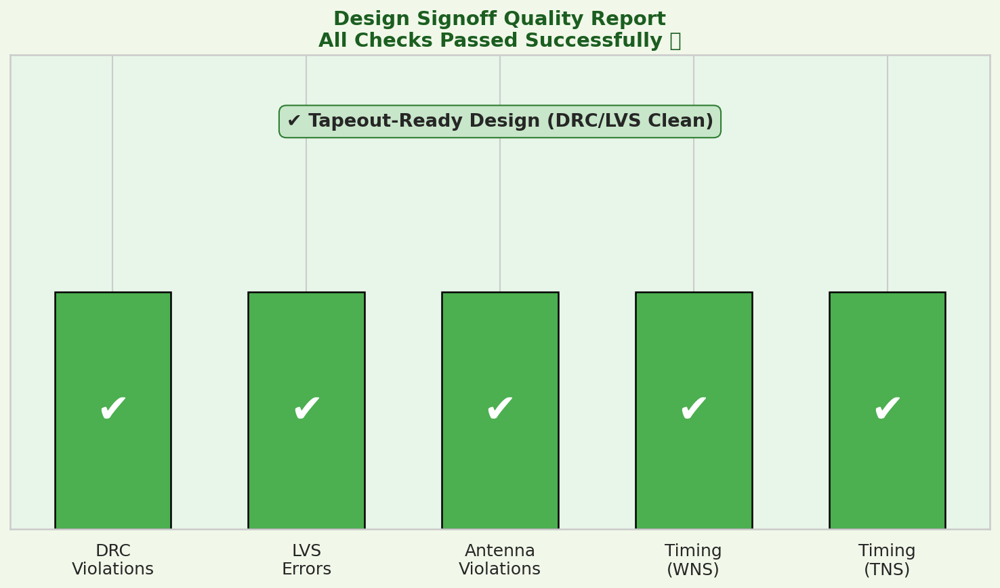
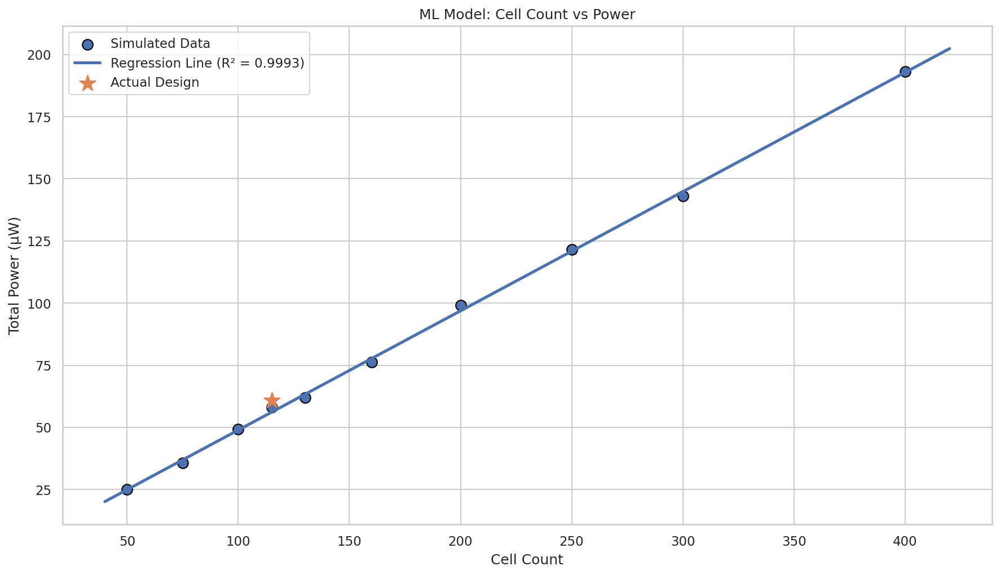
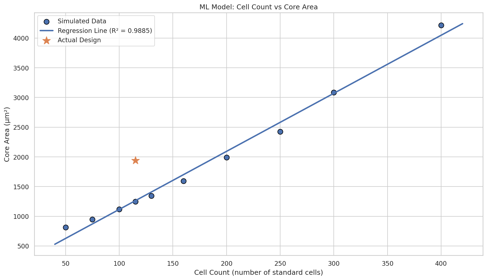

# Data-Driven Analysis and Predictive Modelling of VLSI Design Metrics

> **Leveraging Data Science, EDA, and Machine Learning to optimize VLSI physical design metrics generated from the OpenLane RTL-to-GDSII flow.**

---

## 📌 Project Overview
This project demonstrates how data analytics and machine learning can be integrated into **Electronic Design Automation (EDA)** workflows. By analyzing real physical design metrics, we can better understand the relationship between design constraints and final implementation results.

The analysis focuses on an **8-bit ALU** implemented using the **Sky130 Open-Source PDK** via the **OpenLane** flow. Unlike projects using synthetic data, this project uses **real metrics** extracted directly from the `metrics.csv` file after a successful RTL-to-GDSII implementation.

### Key Features
*   **Data Pipeline:** Extraction, Wrangling, and Preprocessing of VLSI metrics.
*   **EDA:** Deep-dive statistical interpretation of power, area, and timing.
*   **Predictive Modelling:** Linear Regression models to forecast power and area scaling.
*   **Signoff:** Verification of DRC, LVS, and Antenna rules for tapeout readiness.

---

## ⚙️ Project Flowchart
<p align="center">
  
</p>

---

## 🛠 Technologies Used
| Technology | Purpose |
| :--- | :--- |
| **Python** | Core language for Data Analytics & Modelling |
| **Pandas / NumPy** | Data Wrangling and Numerical Operations |
| **Matplotlib / Seaborn** | Data & Statistical Visualization |
| **Scikit-learn** | Machine Learning & Regression Analysis |
| **OpenLane** | RTL-to-GDSII Flow Implementation |
| **Sky130 PDK** | Open-source Semiconductor Technology |
| **Google Colab** | Cloud-based Development Environment |

---

## 📊 Design Under Analysis
| Parameter | Value |
| :--- | :--- |
| **Design** | 8-bit ALU |
| **Technology** | Sky130 PDK |
| **Synthesis Cells** | 115 |
| **Total Physical Cells** | 345 |
| **Core Area** | 1941.86 µm² |
| **Total Power** | 60.8 µW |
| **Critical Path** | 2.34 ns |
| **Clock Period** | 10 ns |
| **Status** | Completed Successfully (Signoff Clean) |

---

## 🔍 Exploratory Data Analysis (EDA)

### 1. Overall Design Metrics Overview
<p align="center"></p>
Provides a holistic view of synthesis, physical design, routing, timing, and power metrics extracted from the flow.

### 2. Power Breakdown Analysis
<p align="center"></p>
*   **Key Insight:** Switching power contributes ~58.1% of total power. Dynamic power heavily dominates this ALU design, while leakage remains negligible.

### 3. Standard Cell Distribution
<p align="center"></p>
*   **Key Insight:** OR gates dominate the design due to the specific arithmetic and logic operations required by the ALU architecture.

### 4. Routing Layer Utilization
<p align="center"></p>
*   **Key Insight:** Most routing is concentrated on `met1` and `met2`. No congestion was observed; all layers remain well below the density threshold.

### 5. Physical Cell Breakdown
<p align="center"></p>
*   **Key Insight:** Decap, Fill, and Welltap cells contribute significantly to layout overhead, highlighting the impact of physical support cells in modern PDKs.

### 6. Timing & Signoff Summary
<p align="center"></p>
<p align="center"></p>
*   **Key Insight:** Timing closure was achieved with positive setup and hold slack. The design is **DRC, LVS, and Antenna clean**—fully tapeout ready.

---

## 🤖 Predictive Modelling
Using realistic VLSI scaling trends, Linear Regression models were implemented to demonstrate ML-driven design forecasting.

### Power Prediction Model
*   **Results:** R² Score ≈ **0.999** | Prediction Error ≈ **4.67 µW**
*   **Insight:** Power scales approximately linearly with cell count for this specific combinational architecture.
<p align="center"></p>

### Area Prediction Model
*   **Results:** R² Score ≈ **0.988**
*   **Insight:** The model slightly underestimates area because it must account for non-linear physical design overhead like Fill cells and routing spacing constraints.
<p align="center"></p>

---

## 📂 Repository Structure
```text
Data-Driven-Analysis-and-Predictive-Modelling-of-VLSI-Design-Metrics/
├── data/
│   ├── vlsi_metrics.csv         # Raw metrics from OpenLane
│   └── vlsi_long_format.csv     # Preprocessed data for analysis
├── notebook/
│   └── Data_Analytics_PBL_VLSI.ipynb
├── plots/                       # Generated visualizations
└── README.md
```

## 👨‍💻 Author
**Sarthak Tripathi**  
*B.Tech Electronics Engineering (VLSI Design & Technology)*  
Jaypee Institute of Information Technology, Noida  

[](https://github.com/quarky-1)
[](https://www.linkedin.com/in/sarthak-tripathi-0b925b1b7/)

---

## 🙏 Acknowledgements
*   **OpenLane Project** & **OpenROAD Community**
*   **SkyWater PDK Initiative**
*   **Data Science Libraries:** Pandas, Scikit-learn, Seaborn, Matplotlib
